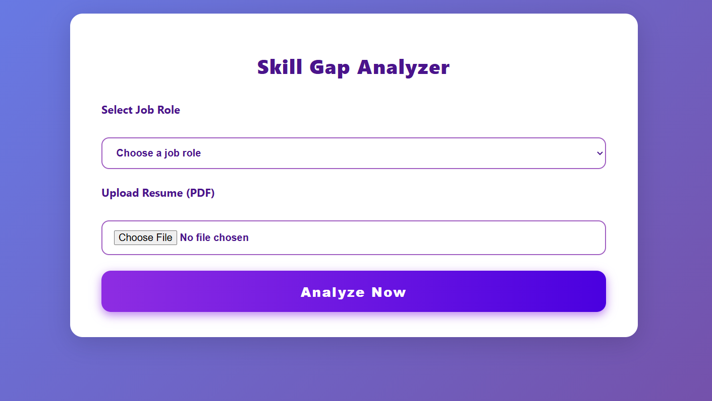
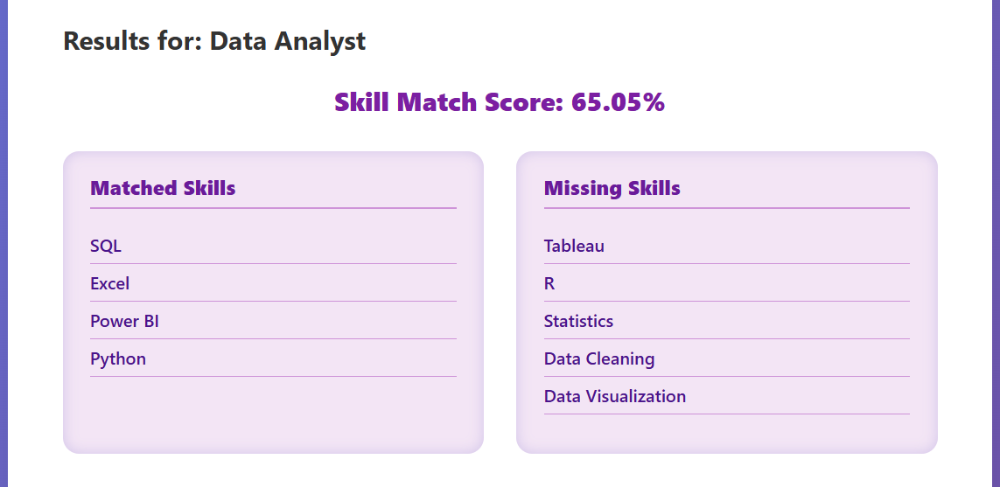
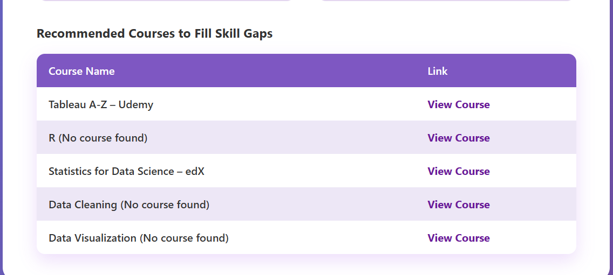

# Skill Gap Analyzer (Flask Version)

A Flask web application to analyze the skill gap between a candidate’s resume and selected job role requirements, featuring a user-friendly interface and detailed course recommendations.

---

## 🧰 Tech Stack

- Python  
- Flask  
- PyMuPDF (fitz)  
- Sentence Transformers (NLP)  
- NumPy  
- HTML/CSS (Bootstrap optional)


---

## 🛠 Features

- Upload resume PDF and extract skills using NLP
- Select job roles to compare skill requirements
- Compute semantic similarity between candidate and job role skills
- Display matched and missing skills with percentage match score
- Recommend relevant online courses to fill skill gaps
- Intuitive and responsive user interface built with Flask

---

## 📸 Screenshots

### Upload Resume  


### Skill Gap Results  


### Course Recommendations  


---

# 🙌 Contributions
Contributions and feedback are welcome! Feel free to open issues or submit pull requests.

---

## 🚀 Run Locally

1. Clone the repository
 ````
git clone https://github.com/Tanishqfarkya5/skill-gap-analyzer-flask.git
cd skill-gap-analyzer-flask
 ````
